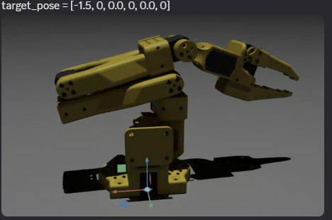
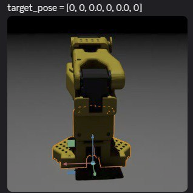
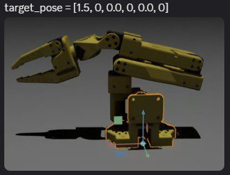

[README.md](https://github.com/user-attachments/files/22642789/README.md)
# SO100 Standalone Control (Isaac Sim 5.x)

> A minimal, code-first README to load the **SO100 robot**, step physics with the **Core API**, and animate the arm smoothly between presets.

---

## 📸 Poses Preview

| Left | Zero | Right |
|---|---|---|
|  |  |  |

Each preview shows the target joint vector used for the base joint: `[-1.5, 0, 0, 0, 0, 0]`, `[0, 0, 0, 0, 0, 0]`, and `[1.5, 0, 0, 0, 0, 0]` (radians).

---

## ✅ Requirements

- **Isaac Sim 5.x** installed.
- Access to the SO100 asset at:
  `Isaac/Robots/RobotStudio/so100/so100.usd` inside the Isaac assets root.
- Run as a **standalone** script (not the Script Editor / VS Code extension).

---

## ▶️ How to Run

From your Isaac Sim install directory (Linux):

```bash
./isaacsim.sh -p /absolute/path/to/run_so100_standalone.py
# or equivalently
./python.sh /absolute/path/to/run_so100_standalone.py
```

The window will remain open while the `while simulation_app.is_running():` loop runs. Close the window to exit cleanly.

---

## 🧩 Full Example

The following script loads the SO100 USD, creates a `World`, and animates the joints using a **smoothstep** time-parameterized trajectory so motion is gradual (not a snap).
```python
# run_so100_standalone.py
import numpy as np
from isaacsim.simulation_app import SimulationApp

# Start Kit (GUI)
simulation_app = SimulationApp({"headless": False})

import omni.usd
from isaacsim.core.api import World
from isaacsim.core.prims import Articulation
from isaacsim.core.utils.stage import add_reference_to_stage
from isaacsim.storage.native import get_assets_root_path
from isaacsim.core.api.objects.ground_plane import GroundPlane
from pxr import Sdf, UsdGeom, UsdLux

# --- Stage & lighting ---
stage = omni.usd.get_context().get_stage()
UsdGeom.SetStageUpAxis(stage, UsdGeom.Tokens.z)
UsdGeom.SetStageMetersPerUnit(stage, 1.0)
UsdLux.DistantLight.Define(stage, Sdf.Path("/World/Light")).CreateIntensityAttr(300)
GroundPlane(prim_path="/World/GroundPlane", z_position=0.0)

# --- Load SO100 robot ---
assets_root = get_assets_root_path()
so100_usd = assets_root + "/Isaac/Robots/RobotStudio/so100/so100.usd"
arm_path = "/World/Arm"
add_reference_to_stage(so100_usd, arm_path)

arm = Articulation(prim_paths_expr=arm_path, name="Arm")
arm.set_world_poses(positions=np.array([[0.0, -1.0, 0.0]]))

# Create the World AFTER content is on stage
world = World(stage_units_in_meters=1.0)
world.reset()

# Define poses (radians; list length must match the robot's controllable DOFs)
zero_pose   = [0.0, 0.0, 0.0, 0.0, 0.0, 0.0]
left_pose   = [-1.5, 0.0, 0.0, 0.0, 0.0, 0.0]
right_pose  = [ 1.5, 0.0, 0.0, 0.0, 0.0, 0.0]

def smooth_move(world, arm, q_start, q_goal, duration_s=2.5, sim_hz=60):
    steps = max(2, int(duration_s * sim_hz))
    q_start = np.array(q_start, dtype=float)
    dq = np.array(q_goal, dtype=float) - q_start
    for k in range(steps):
        s = k / (steps - 1)              # 0..1
        s = s * s * (3 - 2 * s)          # smoothstep easing
        q = q_start + s * dq
        arm.set_joint_positions([q])
        world.step(render=True)

# --- Main loop keeps the app alive until you close the window ---
while simulation_app.is_running():
    # sweep: zero -> left -> zero -> right -> zero
    q_now = arm.get_joint_positions()[0]
    smooth_move(world, arm, q_now, left_pose,  duration_s=2.0, sim_hz=60)
    smooth_move(world, arm, left_pose, zero_pose, duration_s=1.5, sim_hz=60)
    smooth_move(world, arm, zero_pose, right_pose, duration_s=2.0, sim_hz=60)
    smooth_move(world, arm, right_pose, zero_pose, duration_s=1.5, sim_hz=60)

simulation_app.close()
```


---

## 🔧 Notes / Tips

- **Angles are radians.** If you prefer degrees: `np.deg2rad(degrees)`.
- The length of the pose list must match the robot’s **controllable DOFs**.
- To change the speed, tweak `duration_s` or the update rate `sim_hz`.
- If motion looks springy, increase joint **stiffness** (and adjust **damping**) in the drive settings for the articulation.
- When running inside the **Script Editor / VS Code**, **do not** create or close `SimulationApp`—that’s only for standalone.

---

## 🐛 Troubleshooting

- App closes instantly → you forgot a main loop like `while simulation_app.is_running():`.
- Robot doesn’t move → check that your pose length matches the robot DOFs and that physics is stepping (`world.step(render=True)` is called each update).
- Asset not found → verify `get_assets_root_path()` resolves and `.../RobotStudio/so100/so100.usd` exists.

---

_Last generated: 2025-10-01T14:35:07_
